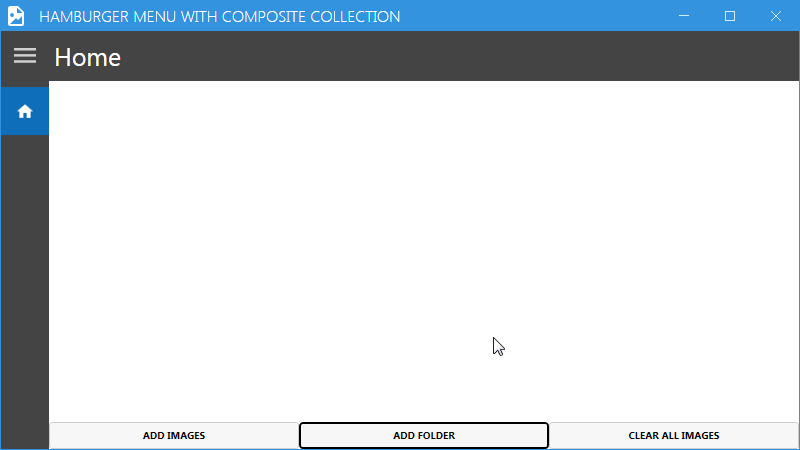
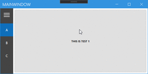
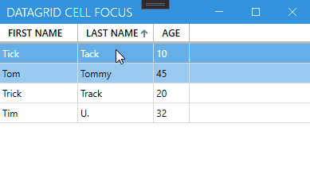
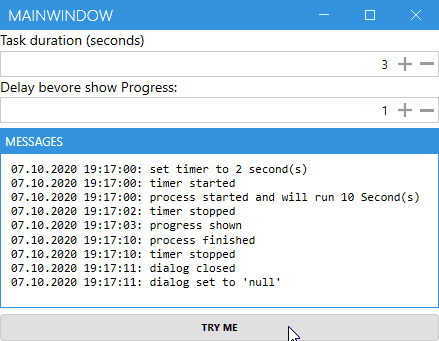
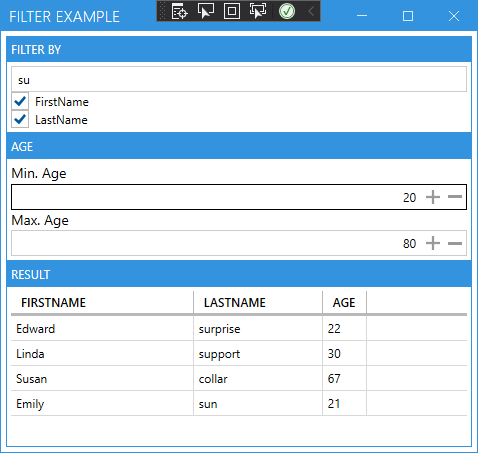
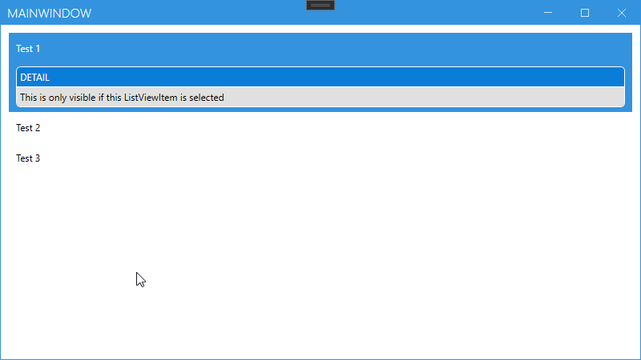

# MahApps.Metro.Examples

-------

## Hamburgermenu sample using CompositeCollection
This sample demonstrates a few advanced possibilities of the cool [MahApps HamburgerMenu](https://mahapps.com). 

### Features
- Uses `CompositeCollection` to show normal `HamburgerMenuItem` together with a dynamic `OservableCollection`
- Uses a custom `DataTemplateSelector` to provide different apperance for the items
- Uses different `DataTemplates`
- Uses `Binding` to show/hide some items

### Preview

--------------------------------------------------------------

## Hamburgermenu with Pane that opens automatically on MouseOver

Attention: This sample should only show that it is possible to do it with a custom `ControlTemplate`. It may be a bad UX / UI. Please think about it before you implement this in your App. 

### Features
- `HamburgerMenu` opens when the user moves the cursor over the items. 

### Preview

--------------------------------------------------------------

## Custom Style for DataGridCell with Trigger

### Features
- A `Button` shows up when the `DataGridCell` becomes the focus
- For now the cell will start editing mode when you click the button

### Preview

--------------------------------------------------------------

## Delayed ProgressDialog 

### Features
- Set time when the dialog should be shown in seconds
- Set time to wait in seconds 
- `ProgressDialog` will appear after the given time, if needed.

### Preview

### Source
[https://github.com/timunie/MahApps.Metro.Examples/tree/master/src/MahApps.Metro.Examples/DelayShowProgressExample](https://github.com/timunie/MahApps.Metro.Examples/tree/master/src/MahApps.Metro.Examples/DelayShowProgressExample)

--------------------------------------------------------------

## Filter Example
### Features
- Filter a list by different filter options
   - match persons first name
   - and or match persons last name
   - and or match persons age
- Filter updates automatically

### Preview

*Shows all persons with first name or last name contain >su< and age between 20 and 80*
### Source
[https://github.com/timunie/MahApps.Metro.Examples/tree/master/src/MahApps.Metro.Examples/FilterDataGridExample](https://github.com/timunie/MahApps.Metro.Examples/tree/master/src/MahApps.Metro.Examples/FilterDataGridExample)

------------------
## ListView with Details
### Features
Opens a detail view only for the selected item. 

### Preview

### Source
https://github.com/timunie/MahApps.Metro.Examples/tree/master/src/MahApps.Metro.Examples/ListViewDetailsExample