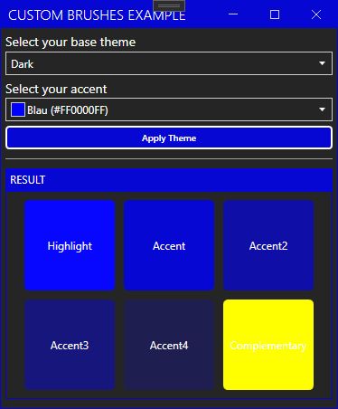
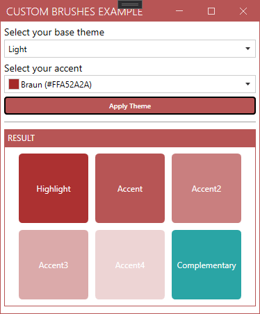

# Tims.Wpf.Examples

Just some code examples. 

-------

## HamburgerMenu sample using CompositeCollection
This sample demonstrates a few advanced possibilities of the cool [MahApps HamburgerMenu](https://mahapps.com). 

### Features
- Uses `CompositeCollection` to show normal `HamburgerMenuItem` together with a dynamic `OservableCollection`
- Uses a custom `DataTemplateSelector` to provide different apperance for the items
- Uses different `DataTemplates`
- Uses `Binding` to show/hide some items

### Preview


--------------------------------------------------------------

## HamburgerMenu with Pane that opens automatically on MouseOver

Attention: This sample should only show that it is possible to do it with a custom `ControlTemplate`. It may be a bad UX / UI. Please think about it before you implement this in your App. 

### Features
- `HamburgerMenu` opens when the user moves the cursor over the items. 

### Preview


--------------------------------------------------------------

## Custom Style for DataGridCell with Trigger

### Features
- A `Button` shows up when the `DataGridCell` becomes the focus
- For now the cell will start editing mode when you click the button

### Preview


--------------------------------------------------------------

## Delayed ProgressDialog 

### Features
- Set time when the dialog should be shown in seconds
- Set time to wait in seconds 
- `ProgressDialog` will appear after the given time, if needed.

### Preview


### Source
[https://github.com/timunie/MahApps.Metro.Examples/tree/master/src/MahApps.Metro.Examples/DelayShowProgressExample](https://github.com/timunie/MahApps.Metro.Examples/tree/master/src/MahApps.Metro.Examples/DelayShowProgressExample)


--------------------------------------------------------------

## Filter Example
### Features
- Filter a list by different filter options
   - match persons first name
   - and or match persons last name
   - and or match persons age
- Filter updates automatically

### Preview


*Shows all persons with first name or last name contain >su< and age between 20 and 80*
### Source
[https://github.com/timunie/MahApps.Metro.Examples/tree/master/src/MahApps.Metro.Examples/FilterDataGridExample](https://github.com/timunie/MahApps.Metro.Examples/tree/master/src/MahApps.Metro.Examples/FilterDataGridExample)

------------------
## ListView with Details
### Features
Opens a detail view only for the selected item. 

### Preview


### Source
https://github.com/timunie/MahApps.Metro.Examples/tree/master/src/MahApps.Metro.Examples/ListViewDetailsExample

------------------------------

## Custom Themes Example

### Features
- Change the current theme via custom accent and base theme
- Apply additionaly `DynamicResources` to provide your own appereance

### How it works
1. In your App.xaml or any other `Resoruces` section add:
```xaml
<Application.Resources>
    <ResourceDictionary>
        <ResourceDictionary.MergedDictionaries>
            <!--  MahApps.Metro resource dictionaries. Make sure that all file names are Case Sensitive!  -->
            <ResourceDictionary Source="pack://application:,,,/MahApps.Metro;component/Styles/Controls.xaml" />
            <ResourceDictionary Source="pack://application:,,,/MahApps.Metro;component/Styles/Fonts.xaml" />
            <!--  Accent and AppTheme setting  -->
            <ResourceDictionary Source="pack://application:,,,/MahApps.Metro;component/Styles/Themes/Light.Blue.xaml" />
        </ResourceDictionary.MergedDictionaries>

        <!-- your Brush goes here -->
        <SolidColorBrush Color="Red" x:Key="My.Brushes.Complementary" />
            
    </ResourceDictionary>
</Application.Resources>
```

2. when you change the `Theme` change also the `Brush`:
```c#
public static void SetAppTheme(string baseTheme, Color accent)
{
    var theme = new Theme("MyTheme",
                            "MyTheme",
                            baseTheme ?? ThemeManager.BaseColorLightConst,
                            accent.ToString(),
                            accent,
                            new SolidColorBrush(accent),
                            true,
                            false);

    var HsvAccent = new HSVColor(accent);

    // Change the Bursh here. You may also want to Freeze it. 
    var newBrush = new SolidColorBrush(new HSVColor(HsvAccent.Hue + 180,
                                                    HsvAccent.Saturation,
                                                    HsvAccent.Value).ToColor());

    newBrush.Freeze();
    App.Current.Resources["My.Brushes.Complementary"] = newBrush;

    ThemeManager.Current.ChangeTheme(App.Current, theme);
}
```

3. Use the new Resource anywhere: 
```xaml
<Border Background="{DynamicResource My.Brushes.Complementary}" />
``` 

### Preview




### Source
[CustomThemesExample](src/Tims.Wpf-Examples/CustomThemesExample)

--------

## Window in a different Thread

### Features 
- Open Window in different Thread
- Moving or resizing the MainWindow will also affect the child 

### How it works
- Using a ViewModel to store the position and react on changes
- Use the `Dispatcher.InvokeAsync` in order to update child window from other thread

### Source
[WindowInDifferentThread](src/Tims.Wpf-Examples/WindowInDifferentThread)